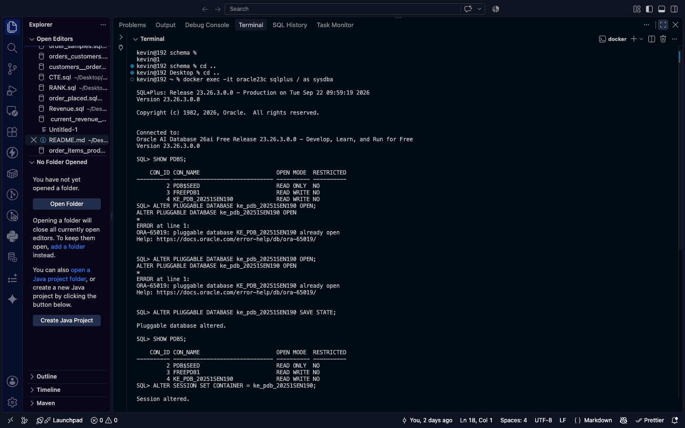
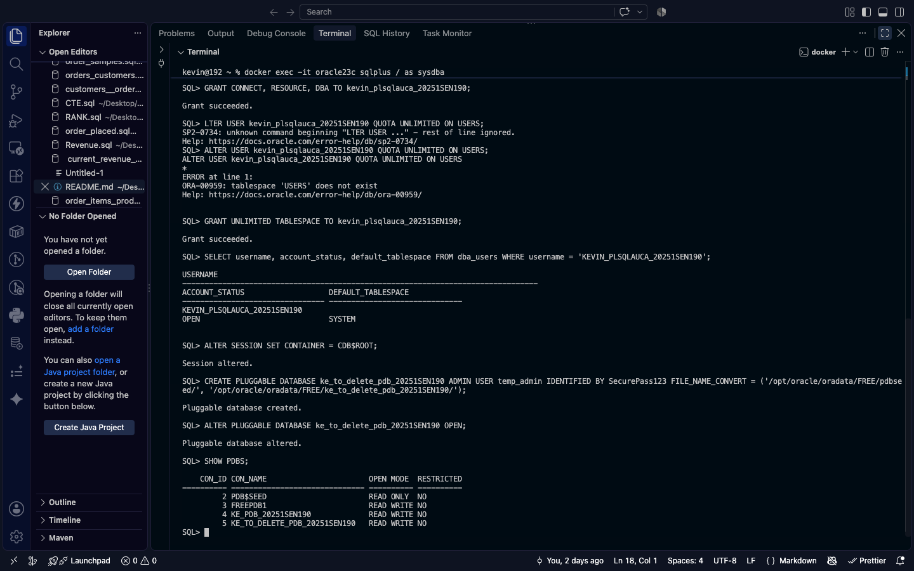
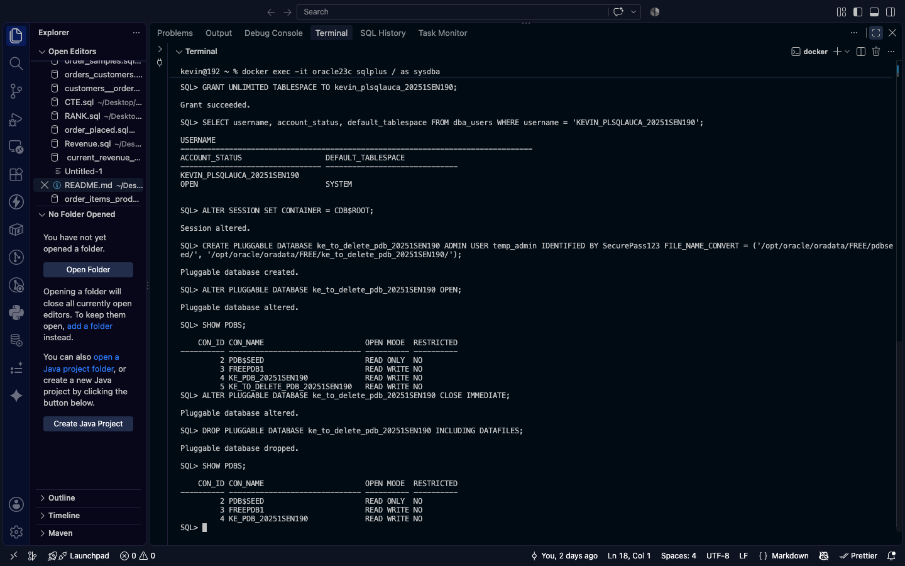
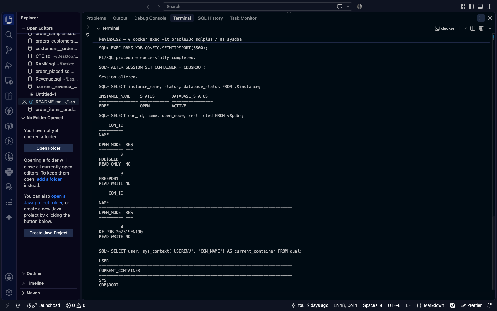

# oracle_pdb_ass_II_20251SEN190_kevin

# Oracle Pluggable Databases (PDB) Management Report

**Course:** Database Development with PL/SQL (INSY 8311)  
**Instructor:** Eric Maniraguha  
**Teaching Assistant:** Afanyu Emmanuel  
**Student Name:** Ishimwe Kevin  
**Student ID:** 20251SEN190  

---

## 1. Executive Summary
This report documents the creation, configuration, and deletion of Oracle Pluggable Databases (PDBs) and local users using Oracle AI Database 23ai Free within a Docker container environment.

---

## 2. Execution & Evidence

### Task 1: Permanent PDB & User Setup
* Created pluggable database `ke_pdb_20251SEN190`.
* Opened and saved the PDB state across database restarts.
* Created user `kevin_plsqlauca_20251SEN190` with DBA privileges.

**Screenshots:**

### Task 1: Permanent PDB & User Setup

---
**Screenshots:**

### Task 2: Temporary PDB Lifecycle Management &  Database & Container Monitoring
* Created temporary PDB `ke_to_delete_pdb_20251SEN190`.
* Verified creation via `SHOW PDBS;`.
* Closed and dropped `ke_to_delete_pdb_20251SEN190` along with its datafiles.

### Task 2 & 3: Temporary PDB Lifecycle Management

---

### Task 3: Database & Container Monitoring
* Queried system catalog views (`v$instance`, `v$pdbs`) to verify database health and container statuses.

---

## 3. Challenges & Solutions
* **Challenge:** Web-based OEM Express ports (5500/8080) were not exposed on the host machine in the container startup configuration.
* **Solution:** Used administrative SQL catalog queries (`v$instance`, `v$pdbs`) directly via SQL*Plus to monitor database metrics and PDB allocation.

---

## 4. Academic Integrity Statement
I hereby declare that all commands were executed individually by me, and all screenshots submitted are original and unshared.

PDB Name Created: ke_pdb_20251SEN190
Issues Encountered: No
